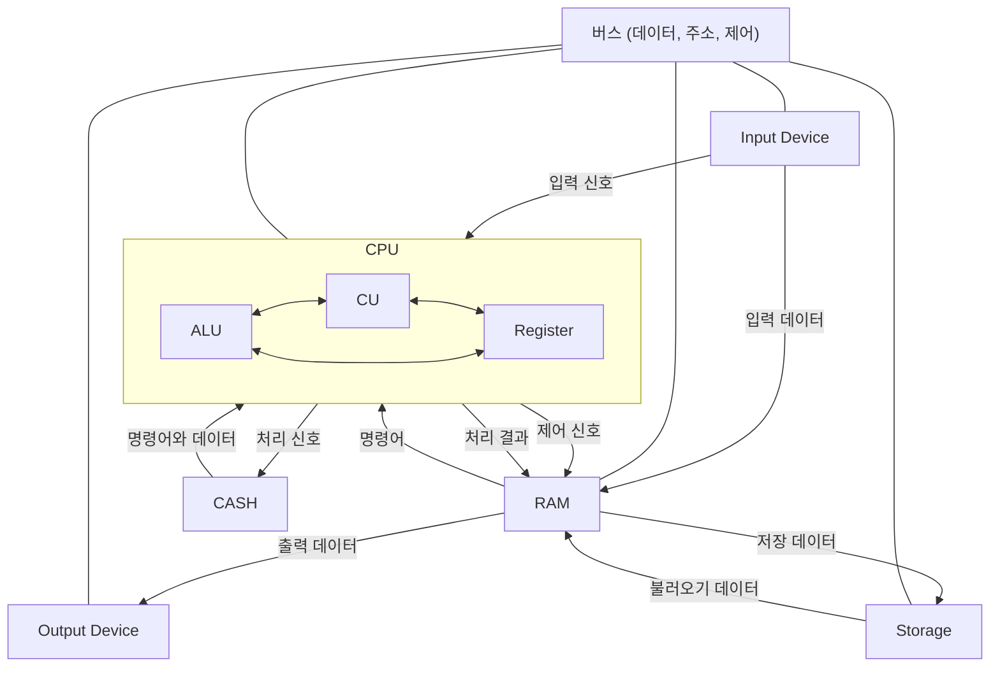

# 동적 메모리 개념

## 컴퓨터 구조



### **CPU**

- ALU(Arithmetic Logic Unit): 산술 연산과 논리 연산을 수행한다.
- CU(Contorl Unot): 명령어를 해석하고 실행 순서를 제어한다.
- Register: CPU 내부의 작은 저장 공간으로, 연산 중 데이터와 명령어를 임시 저장한다.

### **RAM**

- 실행 중인 프로그램과 데이터를 저장한다.
- CPU와의 빠른 데이터 교환이 가능하다.
- 프로그램이 여기에 올라와서 실행된다.

### **CASH**

- CPU와 메모리 사이의 병목현상을 줄이기 위해 자주 사용하는 데이터를 저장한다.
- 레지스터보다는 느리고 RAM 보다는 빠른 속도를 가진다.

### **입력 장치**

- 키보드, 마우스 등 외부 데이터를 컴퓨터 내부로 전달하는 장치.

### **출력 장치**

- 모니터, 프린터 등 컴퓨터 내부 데이터를 외부로 전달하는 장치.

### **보조 기억 장치**

- 하드 디스크, SSD 등 영구적인 데이터 저장을 위한 장치.

### **버스**

- 컴퓨터 구성 요소 간 데이터와 신호를 전달하는 경로.
- 데이터 버스: 실제 데이터를 전달.
- 주소 버스: 메모리 주소를 전달.
- 제어 버스: 제어 신호를 전달.

## 정적 메모리

### 정의

- 프로그램이 실행되기 전에 컴파일 시간에 RAM에서 메모리가 할당된다.
- 할당된 메모리는 프로그램이 종료될 때까지 유지된다.

### 특징

- 할당 시점: 컴파일 시간에 메모리가 할당된다.
- 메모리 위치: 데이터 세그먼트(.data), 스택(stack) 영역에 저장된다.
- 수명: 프로그램의 전체 실행 시간 동안 유지된다.
- 크기 변경: 할당된 메모리 크기는 변경할 수 없다.
- 사용 용도:
    - 전역 변수
    - 정적 지역 변수(static)
    - 상수(const)

## 동적 메모리

### 정의

- 프로그램 실행 중에 필요할 때 RAM에서 메모리를 할당하고, 필요 없을 때 해제한다.
- 동적 메모리는 힙(Heap) 영역에서 관리된다.

### 특징

- 할당 시점: 프로그램 실행 중(run-time)에 메모리가 할당된다.
- 메모리 위치: 힙(Heap) 영역에 저장된다.
- 수명: 개발자가 명시적으로 메모리를 해제(`free`)하지 않는 한 계속 유지된다.
- 크기 변경: `realloc` 함수를 통해 크기를 조정할 수 있다.
- 사용 용도: 실행 중 동적으로 크기가 결정되는 데이터 구조

## 동적 메모리 사용 과정

### 1. 메모리 할당

- 동적 메모리를 요청하여 필요한 크기의 메모리를 힙(Heap) 영역에서 할당받는다.
- C 표준 라이브러리에서 제공하는 함수(`malloc`, `calloc`, `realloc`)를 사용한다.
- 할당된 메모리는 포인터를 통해 접근한다.

### 2. 메모리 초기화

- 할당된 메모리는 초기화되지 않은 상태일 수 있다(`malloc`).
- 필요한 경우 초기화하거나, `calloc` 을 사용하여 0으로 초기화된 메모리를 할당받는다.

### 3. 메모리 사용

- 포인터를 통해 할당받은 메모리에 데이터를 저장하거나 읽어올 수 있다.
- 할당된 크기를 초과해서 접근하지 않도록 주의해야 한다.

### 4. 메모리 재조정 (필요 시)

- `realloc` 을 사용하여 기존 메모리 크기를 조정할 수 있다.
- 기존 데이터를 유지하면서 메모리 크기를 확장하거나 축소한다.

### 5. 메모리 해제

- 사용이 끝난 동적 메모리를 `free` 함수로 해제하여 메모리 누수를 방지한다.
- `free` 이후 해당 포인터를 NULL로 초기화하는 것이 안전하다.

## 데이터 세그먼트

### 정의

- 데이터 세그먼트는 프로그램 실행 중 정적(static) 데이터와 전역(global) 데이터를 저장하는 메모리 영역이다.
- 초기화된 데이터와 초기화되지 않은 데이터를 각각 다른 하위 영역으로 관리한다.

### 하위 영역

- BSS (Block Started by Symbol)
    - 초기화되지 않은 전역 변수와 정적 변수를 저장.
    - 초기값은 0으로 설정됨.
- 데이터 영역
    - 초기값이 명시적으로 설정된 전역 변수와 정적 변수를 저장.

### 특징

- 프로그램 실행이 종료될 때까지 지속된다.
- 데이터 세그먼트는 프로그램의 바이너리 파일에 포함되며, 프로그램 실행 시 메모리에 로드된다.
- 프로그램의 크기와 데이터 구조가 정적으로 결정되는 경우 적합하다.

## 스택

### 정의

- 스택 영역은 함수 호출과 관련된 임시 데이터를 저장하는 메모리 영역이다.
- 로컬 변수, 함수의 매개변수, 함수 호출 시 복귀 주소(Return Address) 등이 저장된다.

### LIFO 구조 (Last In, First Out)

- 마지막에 들어간 데이터가 먼저 나오는 구조로 동작한다.
- 함수 호출 시 데이터를 스택에 푸시(push) 하고, 함수가 종료되면 데이터를 스택에서 팝(pop) 한다.

### 자동 메모리 관리

- 로컬 변수와 매개변수는 함수 호출 시 자동으로 생성되며, 함수가 끝나면 자동으로 소멸한다.
- 개발자가 명시적으로 메모리를 해제할 필요가 없다.

### 메모리 할당 속도

- 스택은 고정 크기의 연속적인 메모리 블록으로, 메모리 할당과 해제가 매우 빠르다.

### 메모리 제한

- 스택 크기는 시스템에 따라 제한되어 있으며, 스택이 초과되면 스택 오버플로(Stack Overflow) 오류가 발생할 수 있다.

### 확장 방향

- 스택 메모리는 높은 주소에서 낮은 주소로 확장된다.

### 스택의 구조

```
|-----------------------| <- 높은 주소
|      함수 A           |
|-----------------------|
| 매개변수와 로컬 변수  |
|-----------------------|
|   함수 반환 주소      |
|-----------------------|
|      함수 B           |
|-----------------------|
| 매개변수와 로컬 변수  |
|-----------------------|
|   함수 반환 주소      |
|-----------------------|
|       ...             |
|-----------------------| <- 낮은 주소
```

### 스택의 동작 과정

1. 함수 호출
    1. 호출된 함수의 **매개변수**와 **복귀 주소**가 스택에 저장된다.
    2. 함수 내부에서 선언된 **로컬 변수**가 스택에 할당된다.
2. 함수 반환
    1. 스택에서 로컬 변수와 매개변수가 제거된다.
    2. 복귀 주소로 돌아가 이전 함수의 실행을 계속한다.

## 힙

### 정의

- 힙은 동적 메모리 할당을 위해 사용되는 메모리 영역이다.
- 프로그램 실행 중 개발자가 필요에 따라 메모리를 할당(`malloc`, `calloc`, `realloc`)하고 해제(`free`)할 수 있다.

### 특징

- 크기와 할당 시점이 실행 중(runtime)에서 결정된다.
- 개발자가 명시적으로 메모리를 관리해야 한다.
- 힙은 낮은 주소에서 시작해 위쪽으로 확장된다.
- 메모리 할당이 많아질수록 힙 크기가 증가한다.
- 힙은 큰 크기의 데이터나 가변 크기 데이터를 처리하기 적합하다.
- 할당된 메모리를 해제하지 않으면 메모리 누수가 발생할 수 있다.

## 메모리 종류 비교

| **특징** | **데이터 세그먼트(Data Segment)** | **스택(Stack)** | **힙(Heap)** |
| --- | --- | --- | --- |
| **용도** | 정적 데이터 저장 | 함수 호출, 로컬 변수 저장 | 동적 메모리 할당 |
| **할당 시점** | 프로그램 시작 시(static) | 함수 호출 시 운영체제가 자동 관리 | 실행 중(runtime) |
| **관리 방식** | 운영체제가 자동 관리 | 운영체제가 자동 관리 | 프로그래머가 명시적으로 할당 및 해제 |
| **확장 방향** | 고정 크기 (확장되지 않음) | 높은 주소 → 낮은 주소 | 낮은 주소 → 높은 주소 |
| **속도** | 매우 빠름 | 빠름 | 상대적으로 느림 |
| **메모리 크기 제한** | 크기가 고정 | 크기가 제한됨 | 크기가 비교적 유연함 |
| **오류 위험** | 없음 | 스택 오버플로 | 메모리 누수, 잘못된 참조 |
| **초기화 여부** | 초기화된 데이터와 초기화되지 않은 데이터로 나뉨 | 초기화되지 않음 (수동 초기화 필요) | 초기화되지 않음 (필요 시 명시적 초기화) |
| **할당 방식** | 정적으로 컴파일러가 결정 | 자동으로 할당 및 해제 | 명시적으로 할당 (`malloc`, `free`) 사용 |
| **수명** | 프로그램 종료 시까지 유지 | 함수 호출 동안 유지 | 개발자가 명시적으로 해제할 때까지 유지 |