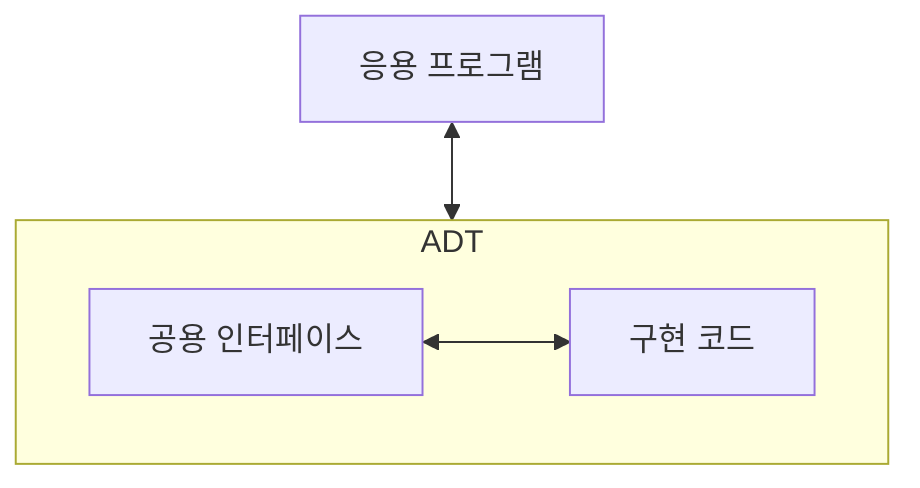
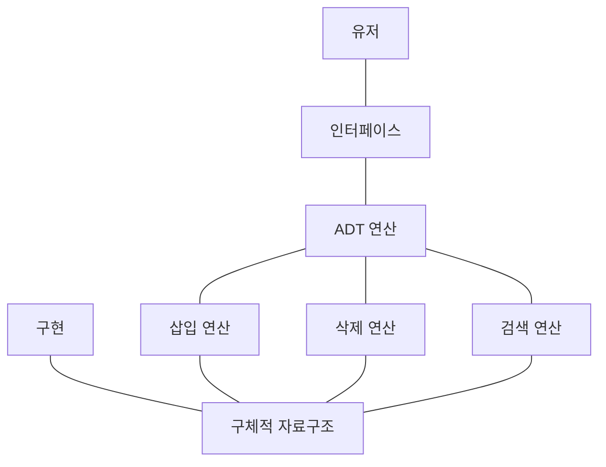

# ADT(Abstract Data Type)

## ADT의 정의

### 개념

- 추상 데이터 타입(Abstract Data Type)은 데이터의 표현 방법과 데이터에 대한 작업(연산)을 명확히 정의하는 논리적 개념이다.
- ADT는 실제적인 구현으로부터 분리된 개념상의 자료형이다.
- 데이터의 구체적인 구현 방법과 무관하게 데이터의 동작 방식을 중심으로 정의한다.
- ADT는 “무엇을 할 수 있는가? “에 초점을 맞추며, “어떻게 구현되는가?”는 구체화하지 않는다.

### 설명

- 인터페이스와 구현의 분리
    - ADT는 사용자가 사용할 수 있는 연산(인터페이스)만 정의한다.
    - 내부 데이터의 저장 방법 및 처리 과정(구현)은 사용자에게 숨긴다.
- 구현 독립성
    - 데이터를 저장하는 자료구조는 추상화 뒤에 감추어진다.
    - ADT를 다양한 방식으로 구현할 수 있으며, 이 과정에서 사용자 코드는 영향을 받지 않는다.
    - 사용자 혹은 프로그램은 ADT를 바탕으로 으로 구현된 인터페이스를 통해 데이터에 접근하고 사용한다.

## ADT의 구성 요소

### 데이터

- ADT가 다루는 데이터의 종류와 구조를 의미한다.
- 데이터는 ADT 외부에서 직접 접근할 수 없다.

### 연산

- 데이터를 다룰 수 있는 일련의 작업을 정의한다.
- 연산의 종류는 삽입, 삭제, 검색, 정렬 등이 포함될 수 있다.

### ADT의 대표적 연산

- **삽입 연산**: 데이터를 추가한다.
- **삭제 연산**: 특정 데이터를 제거한다.
- **탐색 연산**: 데이터의 특정 값을 조회한다.
- **정렬 연산**: 데이터를 정렬된 순서로 배치한다.

## ADT 구조

### 프로그램과 ADT

### 사용자와 ADT

