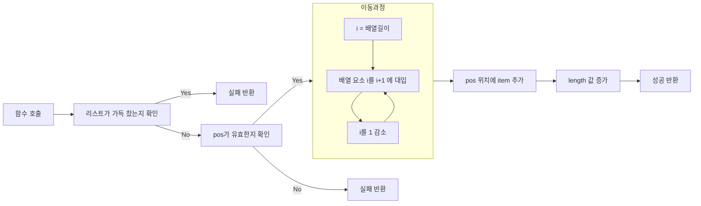
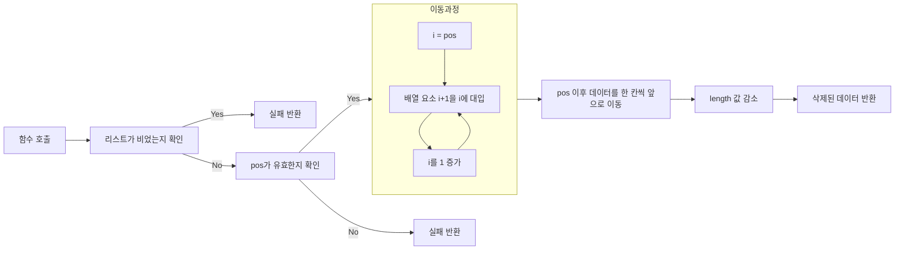

# Array List Type

## 강의 자료에서의 구현

### Object

```c
#define MAX_SIZE 100

typedef int element;
typedef struct
{
	element arr[MAX_SIZE];
	int length;
} ArrayList;
```

- `MAX_SIZE`: 리스트가 저장할 수 있는 최대 요소의 개수를 정의.
- `element`: 리스트의 요소 타입(여기서는 `int`로 정의).
- `ArrayList` 구조체:
    - `arr[MAX_SIZE]`: 데이터를 저장하는 배열.
    - `length`: 현재 리스트에 저장된 데이터의 개수.

### init

```c
void init(ArrayList* list)
{
	list->length = 0;
	return;
}
```

- 기능: 리스트를 초기화.
- 구현: `length` 값을 0으로 설정하여 리스트를 비움.
- 사용: ArrayList를 새로 선언하거나 재사용할 때 사용.

### isEmpty

```c
bool isEmpty(ArrayList* list)
{
	return (list->length == 0);
}
```

- 기능: 리스트가 비어 있는지 확인.
- 구현: `length` 값이 0이면 참(`true`)을 반환.
- 사용: 리스트에 데이터가 없는 상태를 확인할 때.

### isFull

```c
bool isFull(ArrayList* list)
{
	return (list->length == MAX_SIZE);
}
```

- 기능: 리스트가 꽉 찼는지 확인.
- 구현: `length` 값이 `MAX_SIZE`와 같으면 참(`true`)을 반환.
- 사용: 리스트에 더 이상 데이터를 추가할 수 없는 상태를 확인할 때.

### add

```c
int add(ArrayList* list, int pos, element item)
{
	if (!isFull(list) && (pos >= 0) && (pos <= list->length))
	{
		for (int i = list->length - 1; i >= pos; i--)
		{
			list->arr[i + 1] = list->arr[i];
		}
		list->arr[pos] = item;
		list->length++;
		return 0;
	}
	return 1;
}
```



- 기능:
    - 리스트의 특정 위치 `pos`에 `item`을 추가.
- 조건:
    - 리스트가 꽉 차지 않은 상태 (`!isFull(list)`).
    - `pos` 값이 유효한 범위 (`0 <= pos <= length`).
- 구현:
    - `pos` 이후의 데이터를 한 칸씩 뒤로 이동.
    - `pos` 위치에 `item`을 삽입.
    - `length` 값을 1 증가.
- 반환 값:
    - `0`: 성공적으로 삽입.
    - `1`: 삽입 실패 (리스트가 꽉 찼거나, 위치가 유효하지 않음).

### del

```c
element del(ArrayList* list, int pos)
{
	element item = list->arr[pos];
	if (!isEmpty(list) && (pos >= 0) && (pos < list->length))
	{
		for (int i = pos; i < list->length - 1; i++)
		{
			list->arr[i] = list->arr[i + 1];
		}
		list->length--;
		return item;
	}
}
```



- 기능:
    - 리스트의 특정 위치 `pos`에 있는 요소를 삭제하고 반환.
- 조건:
    - 리스트가 비어 있지 않은 상태 (`!isEmpty(list)`).
    - `pos` 값이 유효한 범위 (`0 <= pos < length`).
- 구현:
    - `pos` 위치의 데이터를 저장.
    - `pos` 이후의 데이터를 한 칸씩 앞으로 이동.
    - `length` 값을 1 감소.
- 반환 값:
    - 삭제된 요소의 값.
    - `pos`가 유효하지 않거나 리스트가 비어 있는 경우 동작이 정의되지 않음(예외 처리를 추가해야 안전).

## 나의 구현

동적 할당으로 리스트의 최대 크기를 설정할 수 있도록 하였다.

또한 Python에서 사용하는 방식과 비슷하도록 `append()` 와 `pop()` 함수를 추가하였다.

의미가 정확하게 드러나도록 `add()` 함수의 이름을 `insert()` 로 변경하였다.

리스트의 요소를 출력하는 `disp()` 함수를 추가하였다.

### Object

```c
typedef int element;

typedef struct
{
	element* arrPtr;
	int length;
	int MAX_SIZE;
} ArrayList;
```

- `element`: 리스트에 저장될 데이터의 자료형(여기서는 `int`).
- `arrPtr`: 동적 메모리로 할당된 배열의 시작 주소를 저장하는 포인터.
- `length`: 현재 리스트에 저장된 데이터의 개수.
- `MAX_SIZE`: 리스트가 저장할 수 있는 최대 데이터 개수.

### init

```c
void init(ArrayList* list, int listSize)
{
	list->arrPtr = (element*)malloc(listSize * sizeof(element));
	list->MAX_SIZE = listSize;
	list->length = 0;
	return;
}
```

- 기능: 리스트를 초기화.
- 매개변수:
    - `list`: 초기화할 `ArrayList` 객체.
    - `listSize`: 동적으로 할당할 배열의 크기.
- 동작:
    1. `malloc`을 사용해 `listSize` 크기의 동적 메모리를 할당하고 `arrPtr`에 저장.
    2. `MAX_SIZE`를 `listSize`로 설정.
    3. `length`를 0으로 초기화하여 리스트를 빈 상태로 설정.

### isEmpty

```c
bool isEmpty(ArrayList* list)
{
	return (list->length == 0);
}
```

- 기능: 리스트가 비어 있는지 확인.
- 반환값:
    - `true`: 리스트가 비어 있음.
    - `false`: 리스트에 데이터가 있음.

### isFull

```c
bool isFull(ArrayList* list)
{
	return (list->length == MAX_SIZE);
}
```

- 기능: 리스트가 가득 찼는지 확인.
- 반환값:
    - `true`: 리스트가 가득 참.
    - `false`: 리스트에 빈 공간이 있음.

### append

```c
void append(ArrayList* list, element item)
{
	if (!isFull(list))
	{
		list->arrPtr[list->length] = item;
		list->length++;
	}
	else
	{
		printf("\nError: 리스트가 가득 참\n");
		exit(EXIT_FAILURE);
	}
	return;
}
```

- 기능: 리스트의 끝에 `item`을 추가.
- 매개변수:
    - `list`: 데이터를 추가할 `ArrayList` 객체.
    - `item`: 추가할 데이터.
- 동작:
    1. `isFull`로 리스트가 꽉 찼는지 확인.
    2. 비어 있다면, `arrPtr[length]`에 `item`을 저장.
    3. `length`를 1 증가.
    4. 꽉 찼다면 오류 메시지를 출력하고 프로그램 종료.

### insert

```c
void insert(ArrayList* list, int pos, element item)
{
	if (!isFull(list))
	{
		if ((0 <= pos)&&(pos <= list->length))
		{
			for (int i = list->length - 1; i >= pos; i--)
			{
				list->arrPtr[i + 1] = list->arrPtr[i];
			}
			list->arrPtr[pos] = item;
			list->length++;
		}
		else
		{
			printf("\nError: pos 위치 오류\n");
			exit(EXIT_FAILURE);
		}
	}
	else
	{
		printf("\nError: 리스트가 가득 참\n");
		exit(EXIT_FAILURE);
	}
	return;
}
```

- 기능: 리스트의 특정 위치(`pos`)에 `item`을 삽입.
- 매개변수:
    - `list`: 데이터를 삽입할 `ArrayList` 객체.
    - `pos`: 삽입 위치.
    - `item`: 삽입할 데이터.
- 동작:
    1. `isFull`로 리스트가 꽉 찼는지 확인.
    2. `pos`가 유효한 범위인지 확인.
    3. `pos` 이후 데이터를 한 칸씩 뒤로 이동.
    4. `pos` 위치에 `item`을 저장.
    5. `length`를 1 증가.
    6. 조건을 만족하지 못하면 오류 메시지를 출력하고 종료.

### pop

```c
element pop(ArrayList* list)
{
	element item = list->arrPtr[0];
	if (!isEmpty(list))
	{
		for (int i = 0; i < list->length - 1; i++)
		{
			list->arrPtr[i] = list->arrPtr[i + 1];
		}
		list->length--;
		return item;
	}
	else
	{
		printf("\nError: 리스트가 비어있음\n");
		exit(EXIT_FAILURE);
	}
}
```

- 기능: 리스트의 첫 번째 요소를 제거하고 반환.
- 매개변수:
    - `list`: 데이터를 제거할 `ArrayList` 객체.
- 동작:
    1. `isEmpty`로 리스트가 비어 있는지 확인.
    2. 첫 번째 요소를 저장.
    3. 나머지 요소를 한 칸씩 앞으로 이동.
    4. `length`를 1 감소.
    5. 제거된 요소를 반환.
    6. 리스트가 비어 있다면 오류 메시지를 출력하고 종료.

### del

```c
element del(ArrayList* list, int pos)
{
	element item = list->arrPtr[pos];

	if (!isEmpty(list))
	{
		if ((0 <= pos) && (pos < list->length))
		{
			for (int i = pos; i < list->length - 1; i++)
			{
				list->arrPtr[i] = list->arrPtr[i + 1];
			}
			list->length--;
			return item;
		}
		else
		{
			printf("\nError: pos 위치 오류\n");
			exit(EXIT_FAILURE);
		}
	}
	else
	{
		printf("\nError: 리스트가 비어있음\n");
		exit(EXIT_FAILURE);
	}
}
```

- 기능: 리스트의 특정 위치(`pos`)에 있는 요소를 제거하고 반환.
- 매개변수:
    - `list`: 데이터를 제거할 `ArrayList` 객체.
    - `pos`: 제거할 위치.
- 동작:
    1. `isEmpty`로 리스트가 비어 있는지 확인.
    2. `pos`가 유효한지 확인.
    3. `pos` 위치의 데이터를 저장.
    4. `pos` 이후의 데이터를 한 칸씩 앞으로 이동.
    5. `length`를 1 감소.
    6. 제거된 데이터를 반환.
    7. 조건을 만족하지 못하면 오류 메시지를 출력하고 종료.

### disp

```c
void disp(ArrayList* list)
{
	for (int i = 0; i < list->length; i++)
		printf("%d ", list->arrPtr[i]);
	printf("\n");
	return;
}
```

- 기능: 리스트의 모든 데이터를 출력.
- 매개변수:
    - `list`: 데이터를 출력할 `ArrayList` 객체.
- 동작:
    - 리스트의 각 요소를 순차적으로 출력.

### 예시 테스트 코드

```c
int main(void)
{
	ArrayList list;
	int MAX;
	scanf("%d", &MAX);
	init(&list, MAX);
	for (int i=0;i<10;i++)
		append(&list, i);
	disp(&list);
	printf("%d<-\n", pop(&list));
	printf("%d<-\n", pop(&list));
	printf("%d<-\n", pop(&list));
	disp(&list);
	printf("->12, 3\n");
	insert(&list, 3, 12);
	printf("->10, 5\n");
	insert(&list, 5, 10);
	disp(&list);
	printf("%d<-\n", del(&list, 2));
	printf("%d<-\n", del(&list, 1));
	disp(&list);
	free(list.arrPtr);
	return 0;
}
```

```
11
0 1 2 3 4 5 6 7 8 9
0<-
1<-
2<-
3 4 5 6 7 8 9
->12, 3
->10, 5
3 4 5 12 6 10 7 8 9
5<-
4<-
3 12 6 10 7 8 9
```