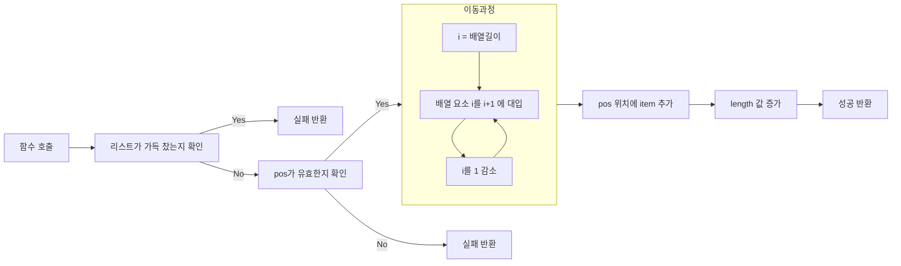
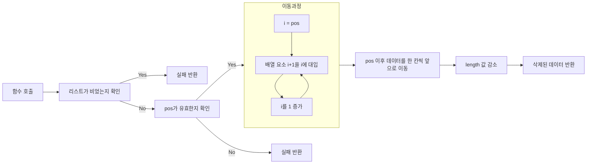

# Array List Type

## 강의 자료에서의 구현

### Object

```c
#define MAX_SIZE 100

typedef int element;
typedef struct
{
	element arr[MAX_SIZE];
	int length;
} ArrayList;
```

- `MAX_SIZE`: 리스트가 저장할 수 있는 최대 요소의 개수를 정의.
- `element`: 리스트의 요소 타입(여기서는 `int`로 정의).
- `ArrayList` 구조체:
    - `arr[MAX_SIZE]`: 데이터를 저장하는 배열.
    - `length`: 현재 리스트에 저장된 데이터의 개수.

### `void init(ArrayList* list)`

```c
void init(ArrayList* list)
{
	list->length = 0;
	return;
}
```

- 기능: 리스트를 초기화.
- 구현: `length` 값을 0으로 설정하여 리스트를 비움.
- 사용: ArrayList를 새로 선언하거나 재사용할 때 사용.

### `bool isEmpty(ArrayList* list)`

```c
bool isEmpty(ArrayList* list)
{
	return (list->length == 0);
}
```

- 기능: 리스트가 비어 있는지 확인.
- 구현: `length` 값이 0이면 참(`true`)을 반환.
- 사용: 리스트에 데이터가 없는 상태를 확인할 때.

### `bool isFull(ArrayList* list)`

```c
bool isFull(ArrayList* list)
{
	return (list->length == MAX_SIZE);
}
```

- 기능: 리스트가 꽉 찼는지 확인.
- 구현: `length` 값이 `MAX_SIZE`와 같으면 참(`true`)을 반환.
- 사용: 리스트에 더 이상 데이터를 추가할 수 없는 상태를 확인할 때.

### `bool add(ArrayList* list, int pos, element item)`

```c
int add(ArrayList* list, int pos, element item)
{
	if (!isFull(list) && (pos >= 0) && (pos <= list->length))
	{
		for (int i = list->length - 1; i >= pos; i--)
		{
			list->arr[i + 1] = list->arr[i];
		}
		list->arr[pos] = item;
		list->length++;
		return 0;
	}
	return 1;
}
```



- 기능:
    - 리스트의 특정 위치 `pos`에 `item`을 추가.
- 조건:
    - 리스트가 꽉 차지 않은 상태 (`!isFull(list)`).
    - `pos` 값이 유효한 범위 (`0 <= pos <= length`).
- 구현:
    - `pos` 이후의 데이터를 한 칸씩 뒤로 이동.
    - `pos` 위치에 `item`을 삽입.
    - `length` 값을 1 증가.
- 반환 값:
    - `0`: 성공적으로 삽입.
    - `1`: 삽입 실패 (리스트가 꽉 찼거나, 위치가 유효하지 않음).

### `element del(ArrayList* list, int pos)`

```c
element del(ArrayList* list, int pos)
{
	element item = list->arr[pos];
	if (!isEmpty(list) && (pos >= 0) && (pos < list->length))
	{
		for (int i = pos; i < list->length - 1; i++)
		{
			list->arr[i] = list->arr[i + 1];
		}
		list->length--;
		return item;
	}
}
```



- 기능:
    - 리스트의 특정 위치 `pos`에 있는 요소를 삭제하고 반환.
- 조건:
    - 리스트가 비어 있지 않은 상태 (`!isEmpty(list)`).
    - `pos` 값이 유효한 범위 (`0 <= pos < length`).
- 구현:
    - `pos` 위치의 데이터를 저장.
    - `pos` 이후의 데이터를 한 칸씩 앞으로 이동.
    - `length` 값을 1 감소.
- 반환 값:
    - 삭제된 요소의 값.
    - `pos`가 유효하지 않거나 리스트가 비어 있는 경우 동작이 정의되지 않음(예외 처리를 추가해야 안전).