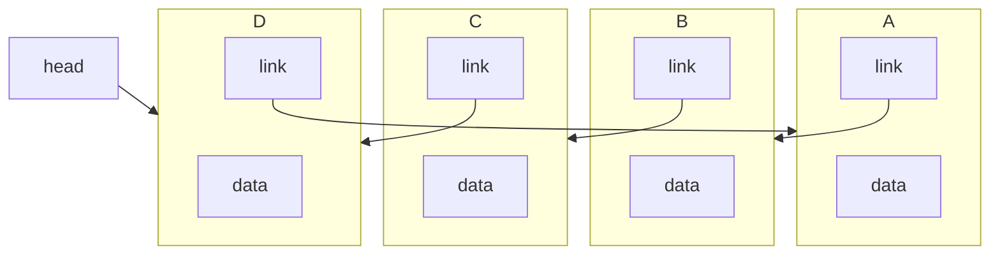
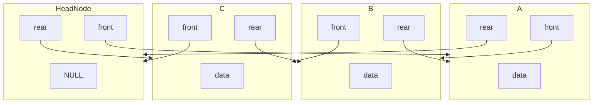

# 리스트의 활용

## 원형 연결 리스트

### Object

```c
typedef int element;

typedef struct listNode
{
    element data;
    struct listNode *link;
} listNode;

typedef struct
{
    listNode *head;
    int length;
} listType;
```



- 단순 연결 리스트와 동일한 객체를 사용한다.
- 이전 노드의 `link` 가 다음 `listNode` 의 주소를 가리키는 형태이다.
- 하지만 처음 혹은 마지막 노드의 삽입 및 삭제를 쉽게 하기 위하여 `head` 는 마지막 노드를 가리킨다.

### insertFirst

```c
void insertFirst(listNode** preHead, listNode* node)
{
	if (*preHead == NULL)
	{
		*preHead = node;
		node->link = node;
	}
	else
	{
		node->link = (*preHead)->link;
		(*preHead)->link = node;
	}
}
```

이 함수는 원형 연결 리스트의 첫 번째 노드로 새로운 노드를 삽입하는 역할을 한다.

- 매개변수:
    - `listNode** preHead`: 리스트의 마지막 노드를 가리키는 포인터의 주소.
    - `listNode* node`: 삽입할 새로운 노드.
- 동작:
    1. 리스트가 비어있는 경우:
        - `preHead`가 `NULL`이면, 리스트가 비어있음을 의미한다.
        - 새로운 노드를 리스트의 첫 노드로 설정하며, 이 노드는 자기 자신을 가리키도록 연결한다.
    2. 리스트가 비어있지 않은 경우:
        - 새로운 노드를 첫 번째 노드로 삽입하고, 원형 구조를 유지하기 위해 링크를 조정한다.
        - 새 노드는 기존 첫 번째 노드의 앞에 삽입된다

### insertLast

```c
void insertLast(listNode** preHead, listNode* node)
{
	if (*preHead == NULL)
	{
		*preHead = node;
		node->link = node;
	}
	else
	{
		node->link = (*preHead)->link;
		(*preHead)->link = node;
		*preHead = node;
	}
	return;
}
```

이 함수는 원형 연결 리스트의 마지막 노드로 새로운 노드를 삽입하는 역할을 한다.

- 매개변수:
    - `listNode** preHead`: 리스트의 마지막 노드를 가리키는 포인터의 주소.
    - `listNode* node`: 삽입할 새로운 노드.
- 동작:
    1. 리스트가 비어있는 경우:
        - `preHead`가 `NULL`이면, 리스트가 비어있음을 의미한다.
        - 새로운 노드를 리스트의 첫 노드로 설정하며, 이 노드는 자기 자신을 가리키도록 연결한다.
    2. 리스트가 비어있지 않은 경우:
        - 새로운 노드를 마지막 노드로 삽입하고, 원형 구조를 유지하기 위해 링크를 조정한다.
        - 삽입된 노드가 새로운 마지막 노드가 된다.

## 이중 연결 리스트

### Object

```c
typedef int element;

typedef struct listNode
{
	element data;
	struct listNode* front;
	struct listNode* rear;
} listNode;
```



- 데이터 필드 (`data`): 각 노드가 저장하는 정수형 값 (`element` 타입).
- 포인터 필드:
    - `front`: 현재 노드의 이전 노드를 가리킴.
    - `rear`: 현재 노드의 다음 노드를 가리킴.
- 용도:
    - `front`와 `rear`를 사용해 노드 간 양방향으로 접근이 가능.
    - 이중 연결 리스트를 구현하는 기본 구조로 사용.

### headNode

- HeadNode는 이중 연결 리스트에서 리스트의 시작과 끝을 관리하는 특별한 노드이다.
- 일반적으로 `data` 필드에 특별한 값을 저장하지 않으며, 리스트의 구조를 관리하는 데에만 사용된다.
- 리스트의 시작 노드와 끝 노드를 연결하며, 리스트의 삽입 및 삭제 연산을 간편하게 수행할 수 있도록 돕는다.

### insertFirst

```c
void dInsertNode(listNode* before, listNode* newNode)
{
	newNode->front = before->front;
	newNode->rear = before;
	before->front->rear = newNode;
	before->front = newNode;
}
```

이 함수는 이중 연결 리스트에서 특정 노드 `before`의 앞에 새로운 노드 `newNode`를 삽입하는 역할을 한다.

동작

1. `newNode`의 `front`와 `rear`를 설정한다:
    - `newNode->front`는 `before->front`를 가리킨다.
    - `newNode->rear`는 `before`를 가리킨다.
2. 기존 노드들의 링크를 수정한다:
    - `before->front->rear`를 `newNode`로 설정하여 `before` 앞의 노드가 `newNode`를 가리키도록 한다.
    - `before->front`를 `newNode`로 설정하여 `newNode`가 `before`의 앞 노드가 되도록 한다.

### insertLast

```c
void dremoveNode(listNode* preHeadNode, listNode* removedNode)
{
	if (preHeadNode == removedNode)
		return;
	removedNode->rear->front = removedNode->front;
	removedNode->front->rear = removedNode->rear;
	free(removedNode);
	return;
}
```

이 함수는 이중 연결 리스트에서 특정 노드 `removedNode`를 삭제하는 역할을 한다.

동작

1. 헤드 노드 보호:
    - `preHeadNode`가 `removedNode`와 동일한 경우, 삭제하지 않고 함수 종료.
2. 링크 조정:
    - `removedNode->rear->front`를 `removedNode->front`로 설정하여 삭제할 노드 앞의 노드가 삭제할 노드의 뒤를 가리키도록 함.
    - `removedNode->front->rear`를 `removedNode->rear`로 설정하여 삭제할 노드 뒤의 노드가 삭제할 노드의 앞을 가리키도록 함.
3. 메모리 해제:
    - `removedNode`를 `free()`를 통해 메모리에서 해제.